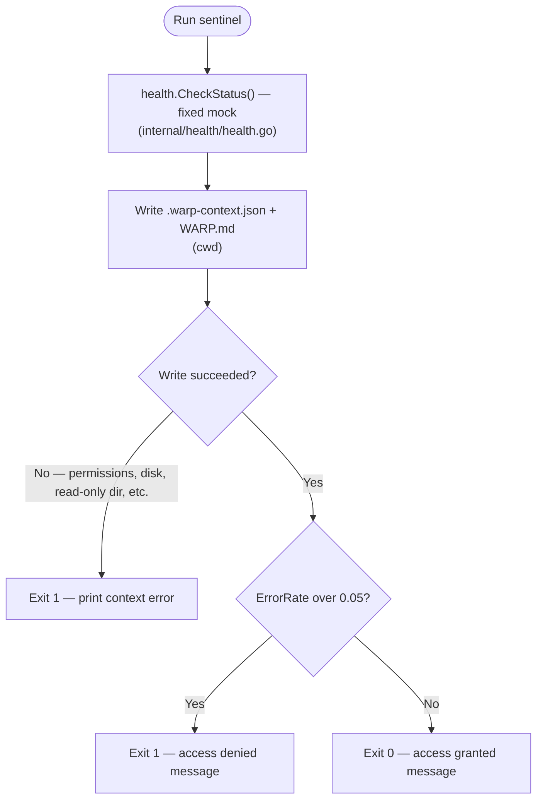

# Sentinel - AI terminal safety gate

I built Sentinel as a tiny Go CLI that sits in front of sensitive terminal workflows (deploy scripts, production shells, anything I don’t want an agent to run blind). It doesn’t replace your monitoring stack or your judgment; it gives me a **repeatable hook**: run a health signal, drop structured context where an LLM can see it, and **stop the chain** if a simple rule says the environment looks unsafe.

This README is deliberately long so you know **exactly** what you’re getting—not a vague “AI safety” product, but a **pattern** you can fork and wire to real data when you’re ready.

---

## What I use it for

- **Gating:** If the check fails, the process exits with a non-zero code, so `&&` in Warp workflows or shell scripts never reaches the dangerous step.
- **Grounding:** I write `.warp-context.json` and `WARP.md` in the **current working directory** so tools and agents have something concrete to read (env name, error rate, status, a short message).
- **Teaching the habit:** The threshold is boring on purpose—one number, one decision—so I’m not pretending this is a full SRE brain.

---

## Scope: what this repo is and isn’t

**It is:**

- A **reference implementation** of “check → write context → compare to threshold → exit.”
- A **Warp-friendly** example via [`.warp/workflows/sentinel-check.yaml`](.warp/workflows/sentinel-check.yaml).
- **Deterministic** today: no network calls, no secrets, no external services in the default path.

**It is not:**

- **Live infrastructure monitoring.** I don’t poll APIs or scrape metrics unless **you** replace `CheckStatus()` with real logic.
- **Authentication or authorization.** Exiting `1` is not the same as proving a human approved something.
- **A guarantee** that an LLM will obey `WARP.md`. Files are hints; your tools and policies still matter.
- **Configured by `config.yaml` or `.env` out of the box.** I describe that as a natural next step below; **this codebase does not load those files yet.** To change behavior today, I edit Go (see [Extending](#extending-this-project)).

If you need bulletproof production gates, treat Sentinel as the **shape** of the hook and plug in your org’s checks, alerts, and approvals—not this mock alone.

---

## How it behaves (today)

I run `sentinel` after building (see [Build & run](#build--run)). The flow below matches `cmd/sentinel/main.go`: mock check → write context files → compare `ErrorRate` to the threshold.



**`.warp-context.json`** is a pretty-printed JSON snapshot of `SystemContext`. **`WARP.md`** is a short Markdown block with `SafetyStatus`, `ErrorRate`, and a static rule line about the threshold.

**Important:** The mock in this repo uses `ErrorRate: 0.08`, which is **above** `0.05`, so **a vanilla build will deny every time** until I change the mock or implement a real check. That’s intentional for demonstrating the “blocked” path; don’t assume the checked-in `WARP.md` / `.warp-context.json` samples match a fresh run unless I’ve aligned those values myself.

**Boundary condition:** The code uses strict greater-than (`ErrorRate > 0.05`), not greater-or-equal, so **an error rate of exactly `0.05` passes** the gate. The text in `WARP.md` matches that. If I need “at or above 0.05 fails,” I’d change the condition to use `>=`.

---

## Edge cases worth knowing

| Situation | What happens |
|-----------|----------------|
| **Run from the wrong directory** | Files land in **whatever directory is cwd**. I can accidentally overwrite another project’s `WARP.md` if I’m not careful. |
| **Concurrent runs** | Two processes writing the same paths can race; last writer wins. No locking. |
| **CI vs laptop** | Same relative paths; in CI the “project root” might differ from my local shell— I set `cwd` explicitly in the workflow or script. |
| **Mock vs real checks** | Until I replace the mock, **nothing** about production is actually measured. |
| **Threshold only looks at `ErrorRate`** | `SafetyStatus` and `Message` are informational for files and logs; the **only** automatic gate is `ErrorRate > 0.05`. |
| **Unicode / emoji in terminal** | Output uses emoji and colored text via `fatih/color`; dumb terminals or log collectors might look noisy or strip colors—that’s cosmetic, not functional. |
| **Warp workflow** | The sample uses `./sentinel && …`. If `sentinel` isn’t executable or not on disk next to that path, the **first** command fails and the rest never runs—which is what I want for a gate, but it can confuse me if I forget to build or `chmod`. |

---

## Build & run

From the repo root:

```bash
go build -o sentinel ./cmd/sentinel
./sentinel
```

I can also put the binary on my `PATH` and invoke `sentinel` from anywhere—remember that **context files still write to cwd**, not next to the binary.

**Dependencies:** Go 1.25+ (see `go.mod`), plus `github.com/fatih/color` for terminal styling.

---

## Warp workflow

[`.warp/workflows/sentinel-check.yaml`](.warp/workflows/sentinel-check.yaml) runs `./sentinel` and only then runs a follow-up command (in the example, an echo standing in for a deploy). I adjust the `command` line to match where I built the binary and what I want to run after the gate passes.

---

## Files you’ll see

| File | Role |
|------|------|
| `.warp-context.json` | JSON for tools; keys match the Go struct field names (`Env`, `ErrorRate`, etc.). |
| `WARP.md` | Short rules snippet for LLM-oriented workflows—not a full policy doc. |

Both are **overwritten** on each successful write path.

---

## Extending this project

- **Real health data:** I replace `CheckStatus()` in `internal/health/health.go` with calls to my metrics API, Kubernetes status, incident API, etc., and map the result into `SystemContext`.
- **Config files:** If I want `config.yaml` or `.env`, I add the load step myself—the README mentioning those is **roadmap**, not current behavior.
- **Different threshold:** The `0.05` constant lives in `cmd/sentinel/main.go`; I’d extract it to a flag or config when I outgrow a single number.
- **Output location:** `internal/context/context.go` uses fixed filenames in cwd; I could add flags for paths if I need multiple projects or read-only trees.

---

## Exit codes (summary)

| Code | Meaning |
|------|---------|
| `0` | Context written; `ErrorRate <= 0.05`. |
| `1` | Context write failed, **or** `ErrorRate > 0.05`. |

I don’t distinguish “denied” vs “write error” by exit code today—if I need that for observability, I’d add distinct codes or structured logs.

---

## License / intent

I’m sharing this as a small, honest building block: **one hook, clear scope, no mystery.** If something here feels underspecified, that’s usually where I’d plug in **my** infrastructure, not where the template pretends to already know it.
